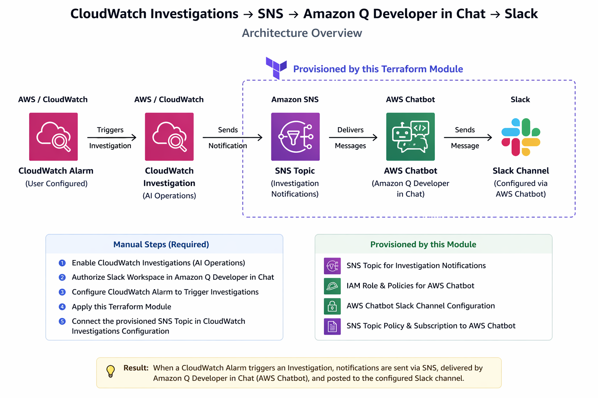

# CloudWatch Investigations Module

This Terraform module provisions the AWS resources necessary to configure **CloudWatch Investigations notifications to Slack** using **Amazon SNS and Amazon Q Developer in chat.**
## Overview
This module creates:
- An SNS topic for investigation notifications
- IAM roles and policies for AWS Chatbot
- AWS Chatbot Slack channel configuration

## Architecture



## Manual Setup Steps (Required)
Some steps must be performed manually in the AWS Console before or after applying this module.

#### 1. Enable Investigations
- Go to **CloudWatch → AI Operations → Configuration**
- Click **Configure for this account**

#### 2. Configure Slack via Amazon Q Developer in Chat
- Go to **Amazon Q Developer in Chat → Configured Clients**
- Click **Configure new Client and choose Slack**
- Authorize Slack workspace

#### 3. Configure CloudWatch Alarm to Trigger Investigations
- Go to **CloudWatch → Alarms**
- Create or edit an alarm
- Configure CloudWatch Alarm to Trigger Investigations
  - DefaultInvestigationGroup
- Save

#### 4. Apply Terraform Module

#### 5. Connect SNS to Investigations
- Go to **Cloudwatch → AI Operation → Configuration → Select SNS Topic**
- Select the SNS topic created by this module (e.g., `myproduct-investigation-notifications-topic`)

## Resulting Flow

```
CloudWatch Alarm
  ↓
CloudWatch Investigation
  ↓
SNS Topic
  ↓
Amazon Q Developer in Chat
  ↓
Slack Channel
```

## Example Usage
```hcl
module "cloudwatch_investigations" {
  source = "../cloudwatch-investigations"
  product = "myproduct"
  tags = {
    Environment = "dev"
  }
  cw_investigation_notifications = {
    slack_workspace_id = "TXXXXXXXX"
    slack_channel_id   = "CXXXXXXXX"
  }
}
```

## Inputs

| Name                          | Type         | Description                          |
|-------------------------------|--------------|--------------------------------------|
| `product`                     | string       | Prefix for resource names            |
| `tags`                        | map(string)  | Tags to apply to resources           |
| `cw_investigation_notifications` | object     | Slack workspace and channel IDs      |

## Outputs
None by default.

## Notes
1. **Slack Workspace Authorization**
    - Go to the [AWS Chatbot Console](https://console.aws.amazon.com/chatbot/home#/chat-clients/slack) and authorize your Slack workspace with AWS Chatbot if not already done.

2. **Slack Channel Configuration**
    - Ensure you have the Slack channel ID and workspace ID for the channel where you want to receive notifications.
    - You can get the channel ID by right-clicking the channel name in Slack and selecting "Copy Link". The ID is the last part of the URL.

4. **SNS Topic Subscription**
    - The module subscribes the SNS topic to AWS Chatbot. If you want to add additional endpoints (e.g., email), you must do so manually or extend the module.
